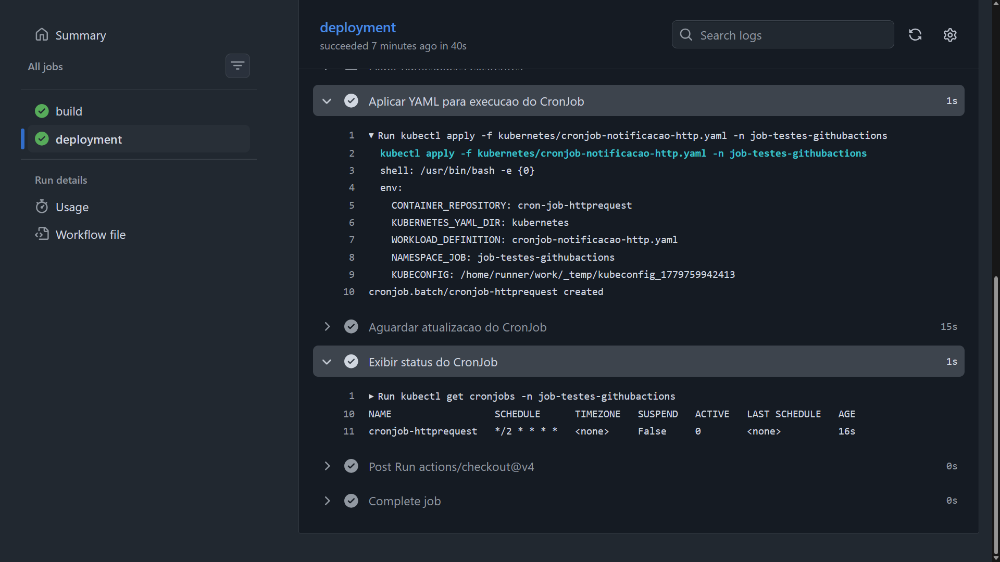

# githubactions-ci-cd-kubernetes-cronjob
Exemplo de workflow do GitHub Actions para build e deployment de um CronJob em um cluster Kubernetes (Azure Kubernetes Service - AKS, mas poderia ser em qualquer outra nuvem ou mesmo on-premise).

Uma execução deste pipeline:

